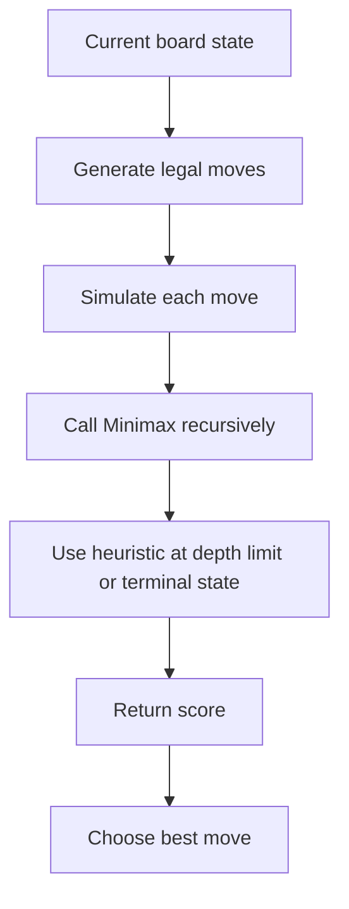
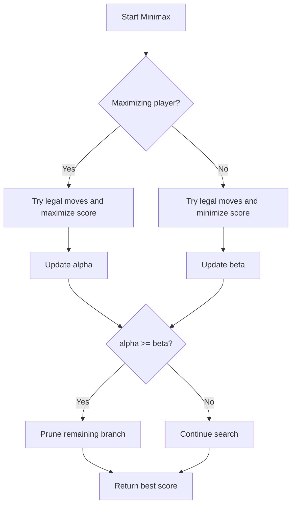
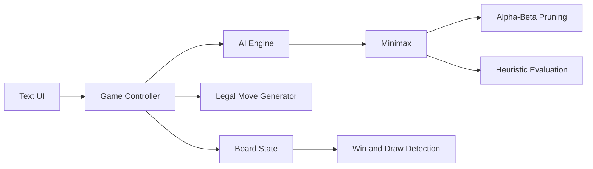
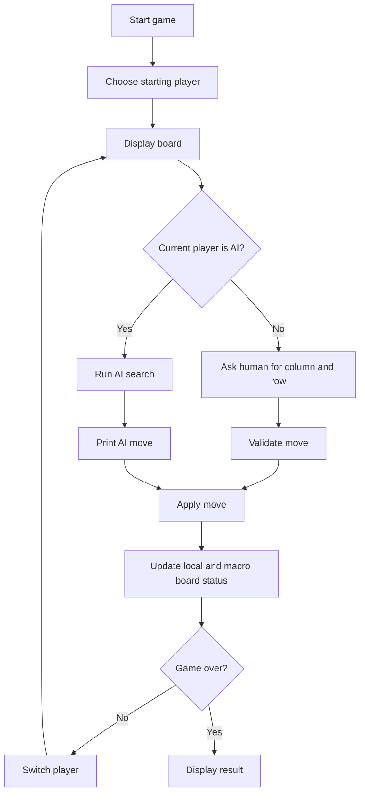

# Ultimate Tic-Tac-Toe AI Battle - Assignment Summary

Source document: `IA-5.pdf`

## 1. Project Goal

The assignment asks each team to build an artificial intelligence able to play **Ultimate Tic-Tac-Toe** against either a human player or another team's AI.

The project is not only about winning games. It is also about designing an AI that can make strong decisions quickly. During the final practical session, AIs will compete against each other, and the scoring system rewards both the game result and the speed of the AI.

In short, the expected project is:

- a playable text-mode Ultimate Tic-Tac-Toe program;
- an AI based on **Minimax**;
- ideally an optimized Minimax using **Alpha-Beta pruning**;
- a custom heuristic evaluation function;
- support for human-vs-AI play;
- practical support for AI-vs-AI matches by manually relaying moves between two machines;
- a final report explaining the implementation choices and code structure.

## 2. Game Overview

Ultimate Tic-Tac-Toe is a larger version of classic Tic-Tac-Toe. Instead of playing on one 3x3 board, players play on a 3x3 grid of smaller 3x3 boards.

That means the full board has:

- **9 rows**;
- **9 columns**;
- **9 local Tic-Tac-Toe boards**;
- **81 playable cells**.

Player 1 uses **X**.  
Player 2 uses **O**.

The winner is the first player to win three local boards aligned on the large board:

- horizontally;
- vertically;
- diagonally.

If no player reaches this condition and all boards are full, the game is declared a draw.

## 3. Board Structure

The full board can be visualized as a 9x9 grid divided into nine smaller 3x3 boards.

```text
Columns:   1 2 3   4 5 6   7 8 9

Row 1      . . . | . . . | . . .
Row 2      . . . | . . . | . . .
Row 3      . . . | . . . | . . .
           ------+-------+------
Row 4      . . . | . . . | . . .
Row 5      . . . | . . . | . . .
Row 6      . . . | . . . | . . .
           ------+-------+------
Row 7      . . . | . . . | . . .
Row 8      . . . | . . . | . . .
Row 9      . . . | . . . | . . .
```

The large board can also be seen as a "macro board", where each cell represents one local Tic-Tac-Toe board:

```text
+-----------+-----------+-----------+
| Board 1   | Board 2   | Board 3   |
| top-left  | top       | top-right |
+-----------+-----------+-----------+
| Board 4   | Board 5   | Board 6   |
| left      | center    | right     |
+-----------+-----------+-----------+
| Board 7   | Board 8   | Board 9   |
| bottom-L  | bottom    | bottom-R  |
+-----------+-----------+-----------+
```

Winning the macro board works like classic Tic-Tac-Toe:

```text
X | X | X      X | . | .      X | . | .
--+---+--      --+---+--      --+---+--
. | . | .      X | . | .      . | X | .
--+---+--      --+---+--      --+---+--
. | . | .      X | . | .      . | . | X

Row win        Column win     Diagonal win
```

## 4. Move Coordinates

The program must use a simple text interface. To make moves easy to identify, rows and columns are numbered from **1 to 9**.

The convention required by the assignment is:

```text
column first, row second
```

For example:

```text
5 8
```

means:

- column 5;
- row 8.

This position is located:

- in the bottom-middle local board;
- in the center cell of that local board.

Coordinate conversion example:

```text
Global move: column = 5, row = 8

Macro board column = floor((5 - 1) / 3) + 1 = 2
Macro board row    = floor((8 - 1) / 3) + 1 = 3

Local column       = ((5 - 1) mod 3) + 1 = 2
Local row          = ((8 - 1) mod 3) + 1 = 2
```

So the move targets the local board at macro position `(2, 3)` and the local cell `(2, 2)`.

## 5. Standard Ultimate Tic-Tac-Toe Move Constraint

The PDF references the detailed rules of Ultimate Tic-Tac-Toe. Under the standard rule set, the cell chosen inside a local board determines which local board the opponent must play in next.

Example:

```text
Current player plays in local cell:

. . .
. X .
. . .

The X is in the center cell.
Therefore, the next player must play in the center local board.
```

If the target local board is already won or full, the next player is usually allowed to play in any available board. The implementation should handle this case clearly because it affects legal move generation and the Minimax search tree.

This rule is important because the AI must not simply choose any empty cell. It must generate only legal moves according to the current forced board.

## 6. Required AI Model

The AI must be based on **Minimax**.

The professor also strongly recommends using **Alpha-Beta pruning**, because the full game tree of Ultimate Tic-Tac-Toe is too large to explore completely.

The AI should therefore follow this general idea:



The assignment explicitly forbids using a dictionary of precomputed moves.

This means:

- the AI cannot rely on a fixed opening book;
- the AI cannot store a table saying "if position A, play move B";
- every decision must be computed dynamically during the game.

Caching already evaluated states can still be acceptable if it is part of the search optimization, but the decision itself must come from computation, not from a hardcoded move list.

## 7. Why a Heuristic Is Needed

A complete Minimax search to the end of the game is usually impossible because Ultimate Tic-Tac-Toe has a very large branching factor.

The assignment expects teams to design their own heuristic function. This function estimates how favorable a board state is without exploring all the way to the final leaves of the game tree.

A useful heuristic can evaluate ideas such as:

- number of local boards already won;
- threats on the macro board;
- local boards where the AI has two marks in a line;
- local boards where the opponent has two marks in a line;
- control of the center local board;
- ability to force the opponent into a bad board;
- avoiding moves that send the opponent to a board where they can immediately win;
- number of available moves;
- draw potential when a local board cannot be won anymore.

Example scoring idea:

```text
Terminal macro win for AI          +infinity
Terminal macro loss for AI         -infinity
Local board won by AI              large positive score
Local board won by opponent        large negative score
Two-in-a-row on macro board        strong positive or negative score
Two-in-a-row inside local board    medium positive or negative score
Center control                     small to medium bonus
Bad forced destination             penalty
```

The exact weights are part of the team's strategy and should be explained in the final report.

## 8. Alpha-Beta Pruning

Alpha-Beta pruning improves Minimax by avoiding branches that cannot influence the final decision.

Conceptually:

- **alpha** is the best score already guaranteed for the maximizing player;
- **beta** is the best score already guaranteed for the minimizing player;
- when a branch becomes worse than a previously found alternative, it can be skipped.



This is especially important in this project because the tournament scoring rewards fast AIs.

## 9. Expected Program Behavior

The program must allow a human player to play against the AI.

At the beginning of a game, the user must be able to choose who starts:

- the human player;
- the AI.

During the human player's turn:

1. the program displays the current board;
2. the player enters a move using column and row;
3. the program validates the move;
4. the board is updated.

During the AI turn:

1. the program displays the current board;
2. the AI launches its model;
3. the AI chooses a move;
4. the chosen column and row are displayed;
5. the board is updated.

The chosen move should always be printed in addition to the board, because this allows two AIs on different machines to fight each other through human intermediaries.

Example text interaction:

```text
Current player: AI (X)
AI move: column 5, row 8

  1 2 3 | 4 5 6 | 7 8 9
1 . . . | . . . | . . .
2 . . . | . . . | . . .
3 . . . | . . . | . . .
  ------+-------+------
4 . . . | . . . | . . .
5 . . . | . . . | . . .
6 . . . | . . . | . . .
  ------+-------+------
7 . . . | . . . | . . .
8 . . . | . X . | . . .
9 . . . | . . . | . . .
```

## 10. AI-vs-AI Battle Format

The AIs are developed in teams of **3 or 4 students**, within the same practical-work group.

During the final practical session, each team's AI will play against the other AIs from the group.

The AI must run on **Google Colab**, which means the code should be easy to execute in a cloud notebook environment.

A match between two AIs contains **two games**:

1. AI A starts the first game.
2. AI B starts the second game.

A game ends when:

- one AI wins three aligned local boards on the macro board;
- or the full 9x9 grid is filled.

If the game is a draw, the player who has won the most local boards wins the game according to the battle rules. If both players have won the same number of local boards, the game remains a true draw.

## 11. Timing and Scoring

Each AI move will be timed. This is a central part of the assignment, not a minor detail.

The project therefore involves a tradeoff:

- deeper search usually gives better moves;
- deeper search also costs more time;
- faster play can earn additional points;
- a purely defensive strategy may lead to draws, but the scoring system discourages relying only on draws.

Scoring table from the assignment:

| Game result | Fastest AI? | Points earned |
|---|---:|---:|
| Win | Yes | 4 |
| Win | No | 3 |
| Draw | Yes | 1 |
| Draw | No | 0 |
| Loss | Yes | 1 |
| Loss | No | 0 |

The key strategic lesson is that speed matters even in losing or drawing games.

## 12. Recommended Architecture

A clean implementation can be organized around the following components:



Recommended responsibilities:

| Component | Responsibility |
|---|---|
| Board state | Store the 9x9 grid, local board results, macro board result, current player, and forced board. |
| Legal move generator | Return all valid moves according to the current state and Ultimate Tic-Tac-Toe rules. |
| Game controller | Alternate turns, validate input, update state, and detect the end of the game. |
| AI engine | Choose the best move using Minimax, Alpha-Beta pruning, and the heuristic. |
| Text UI | Display the board, ask for human moves, and print the AI's chosen move. |
| Report | Explain algorithmic choices, heuristic design, optimizations, and limitations. |

## 13. Suggested Turn Loop



## 14. Important Implementation Details

The implementation should be able to play several games in a row without crashing.

Important cases to handle:

- invalid human coordinates;
- occupied cells;
- forced local board already full;
- forced local board already won;
- local board draw;
- macro board win;
- macro board draw;
- tie-break by number of local boards won;
- time spent by the AI for each move;
- switching correctly between X and O;
- displaying coordinates clearly.

## 15. Final Deliverables

At the end of the project, each team must submit:

- the source code;
- a written report;
- an explanation of the implementation choices;
- details about the AI model;
- details about the heuristic;
- enough information to understand how the code works and how to run it.

The submission must be uploaded to **DVO** the day before the final practical session.

## 16. Evaluation Criteria

The grade will mainly depend on:

- correct implementation of Minimax;
- use of Alpha-Beta pruning;
- correctness of the playable program;
- ability to play several games without bugs;
- quality of the heuristic;
- performance during AI battles;
- points earned during the final competition.

## 17. Practical Strategy for the Project

A strong solution should focus on three priorities:

1. **Correct rules first**  
   The AI cannot be reliable if move generation or win detection is wrong.

2. **Efficient search second**  
   Minimax must be optimized with Alpha-Beta pruning, good move ordering, and a reasonable depth limit.

3. **Useful heuristic third**  
   The heuristic should recognize both local threats and macro-board opportunities.

A possible development order:

```text
1. Implement board representation.
2. Implement legal move generation.
3. Implement local board win detection.
4. Implement macro board win detection.
5. Implement human-vs-human or random-vs-random testing.
6. Add Minimax.
7. Add Alpha-Beta pruning.
8. Add heuristic evaluation.
9. Add timing control and move ordering.
10. Test complete games repeatedly.
11. Write the final report.
```

## 18. Final Summary

This assignment is an AI competition project built around Ultimate Tic-Tac-Toe. The program must provide a text-based playable game and an AI that chooses moves dynamically using Minimax. Because the complete game tree is too large, the AI should use Alpha-Beta pruning and a custom heuristic to make strong decisions quickly.

The final competition rewards both result and speed. A winning AI earns more points if it is also the fastest, and even a losing AI can earn a point if it plays faster than its opponent. The best project will therefore combine correctness, strategic quality, efficient search, and robust execution.
